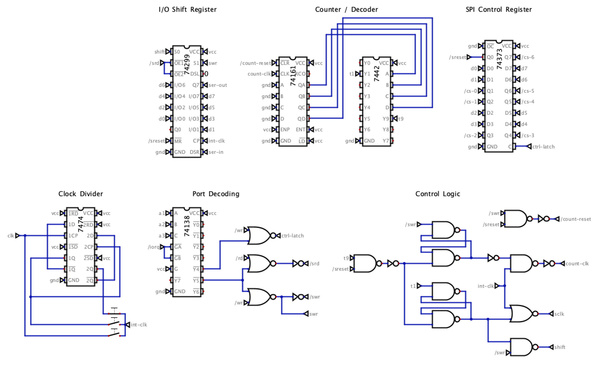

# Hardware SPI Controller for Beanboard

Digital simulation files and schematic for a hardware SPI controller designed as a BeanBoard plug-in.

Uses a 74299 universal shift register for bidirectional data transfer, with a 74161 counter and 7442 decoder for bit timing. The '299's tri-state outputs connect directly to the Z80 bus.

