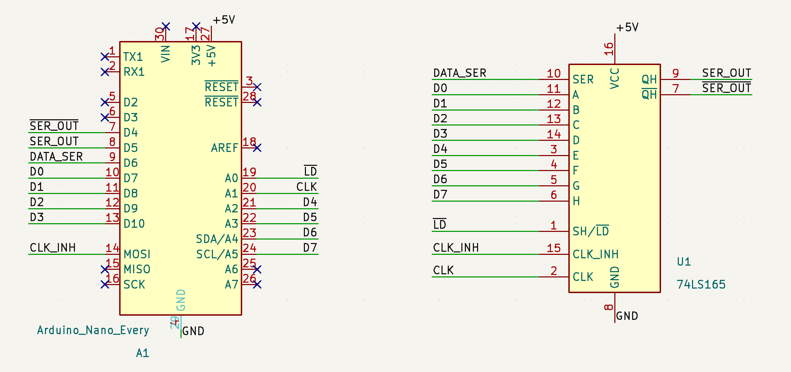
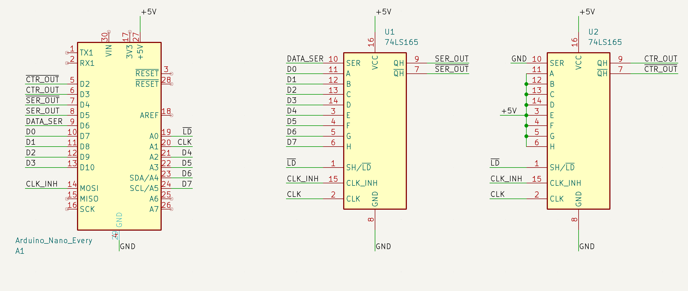
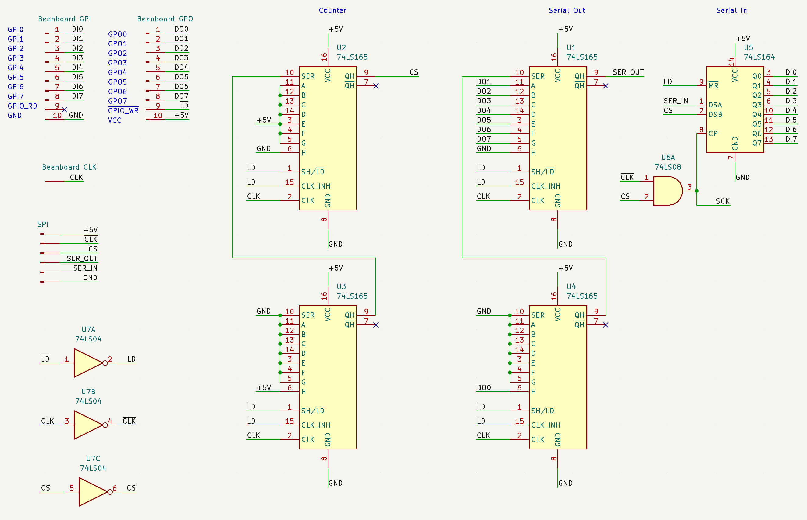
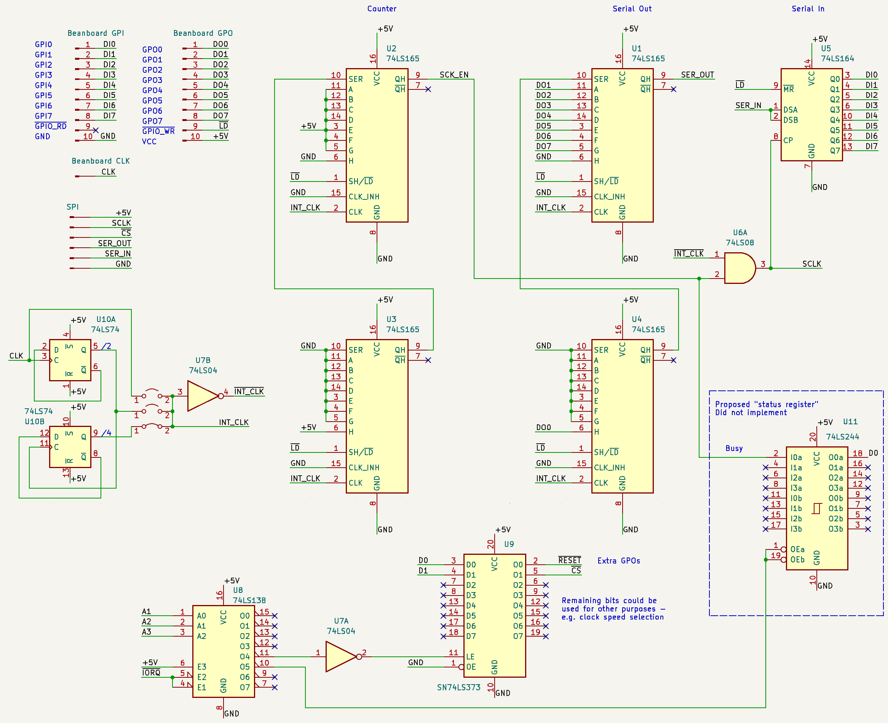
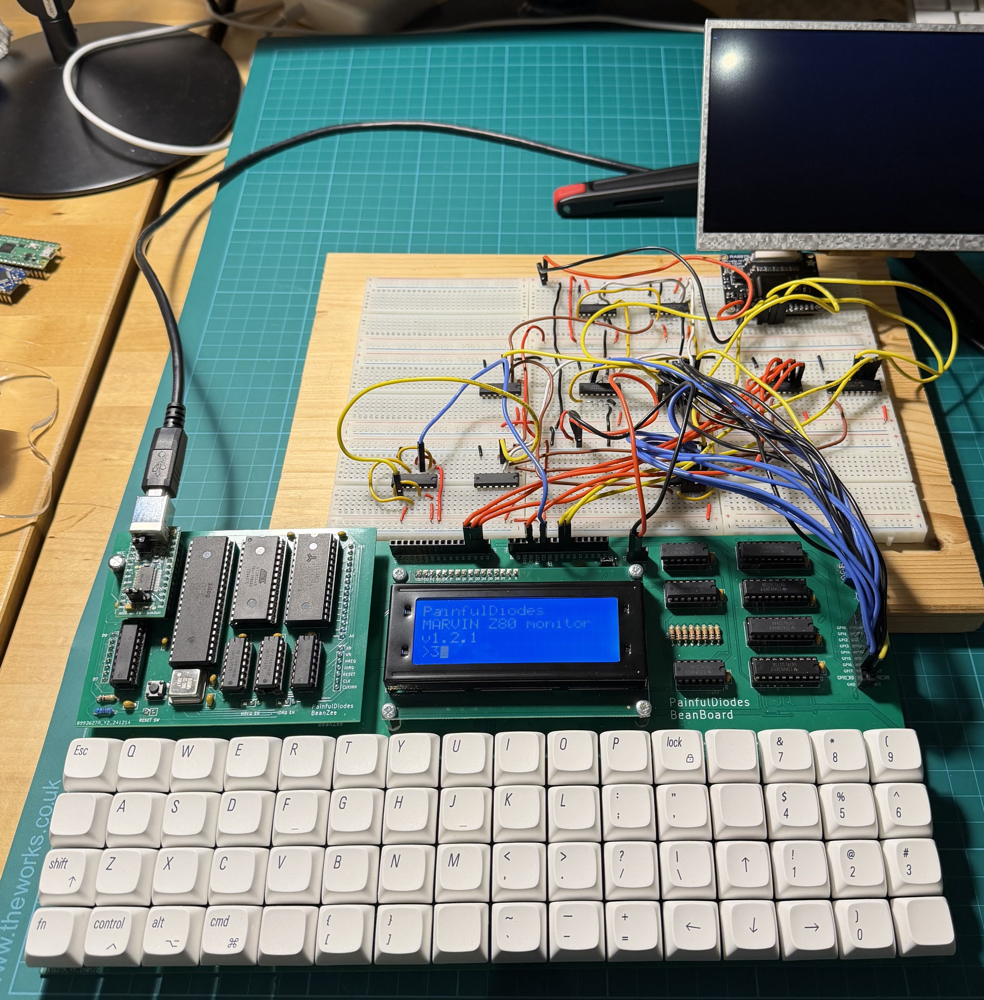
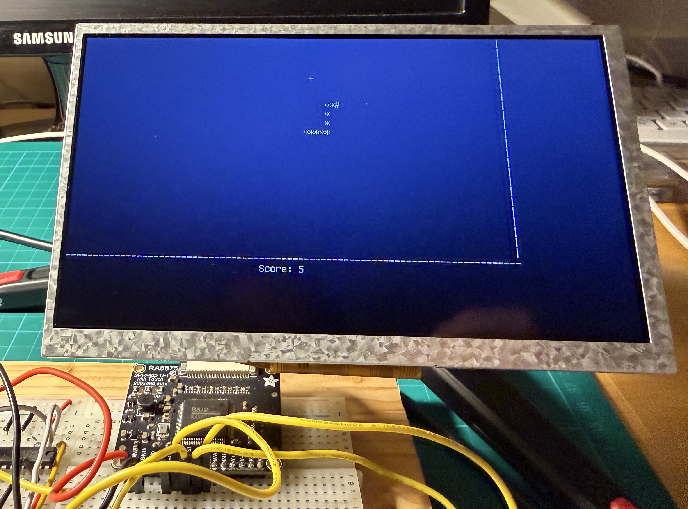

# PainfulDiodes Experiment: Breadboard SPI Interface

## PISO (parallel-in serial-out) shift-register - 74LS165

Test of 74LS165 on breadboard with an Arduino.

[arduino/74LS165_test_0/](arduino/74LS165_test_0/)

[kicad/74LS165_test_0/](kicad/74LS165_test_0/)

## Bit Counter

Test with a second 74LS165 to act as a bit counter on breadboard with an Arduino.

[kicad/74LS165_test_1/](kicad/74LS165_test_1/)

## Digital Circuit Simulator

Switch over to using [github.com/hneemann/Digital](https://github.com/hneemann/Digital) to experiment with different designs.

Design files: [digital/](digital/)

Simulated SPI solution:

Alternative design - JK flip-flops:

Alternative design: Binary counter - 74LS163: 

Loopback test:

## Back to breadboard

Implement the simulated design on a breadboard.

## Nano loopback test

Test the breadboard SPI implementation with an Arduino, using a simple loopback (feed serial out back to serial in).

[kicad/SPI_nano/](kicad/SPI_nano/)

[arduino/spi_test/](arduino/spi_test/)

## Z80 loopback test

Test the SPI loopback with the BeanBoard Z80 computer.

[z80/gpio_echo/](z80/gpio_echo/)

## RA8875 tests and debugging

Attept to interface the RA8875 TFT display controller via SPI using the breadboard SPI implementation. Debug and fix.

[kicad/SPI_beanboard/](kicad/SPI_beanboard/)

## Revised implementation

Apply the necessary fixes to the breadboard SPI implementation.

[kicad/SPI_beanboard_2/](kicad/SPI_beanboard_2/)

The final design required a system clock divider:

[digital/clock_divider.dig](digital/clock_divider.dig)

Test program / library to drive the RA8875 via SPI from the BeanBoard:

[z80/beanboard_RA8875_hardware_SPI/](z80/beanboard_RA8875_hardware_SPI/)

## Snake

Example program to test the whole setup.

[z80/RA8875_snake/](z80/RA8875_snake/)
