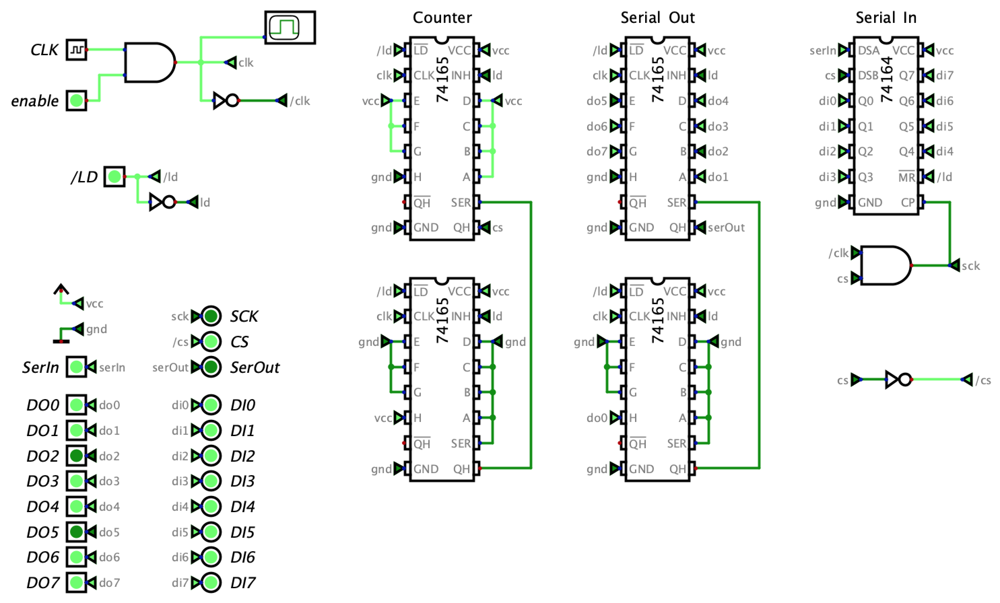
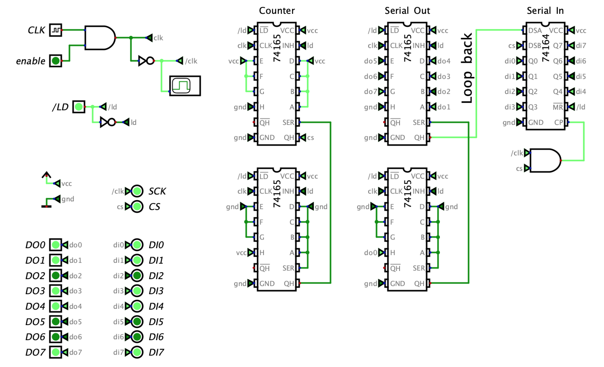

# PainfulDiodes Experiment: Breadboard SPI Interface

## PISO (parallel-in serial-out) shift-register - 74LS165

[arduino/74LS165_test_0/](arduino/74LS165_test_0/)

[kicad/74LS165_test_0/]](kicad/74LS165_test_0/)

## Bit Counter

[kicad/74LS165_test_1/](kicad/74LS165_test_1/)

## Digital Circuit Simulator

[github.com/hneemann/Digital](https://github.com/hneemann/Digital)

[digital/74165_test_0.dig](digital/74165_test_0.dig)

[digital/74165_test_1.dig](digital/74165_test_1.dig)

## Simulated SPI solution

[digital/spi.dig](digital/spi.dig)

## Alternative design - JK flip-flops

[digital/spi_simplification_1_jk.dig](digital/spi_simplification_1_jk.dig)

## Alternative design: Binary counter - 74LS163

[digital/spi_simplification_2_74163.dig](digital/spi_simplification_2_74163.dig)

## Loopback test

[digital/spi_loopback.dig](digital/spi_loopback.dig)

## Back to breadboard

## Nano loopback test

[kicad/SPI_nano/](kicad/SPI_nano/)

[arduino/spi_test/](arduino/spi_test/)
